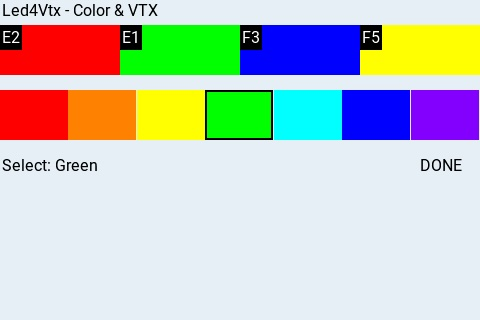

# Led4Vtx & Led4VtxLite

日本語版は下部にあります。

---

## English

### Prerequisites

Please configure your drone's LED Strip settings to display arbitrary colors in advance.
See (https://github.com/nkozawa/Led4Vtx/blob/main/img/LEDStrip.png) for a sample screen.

Alternatively, you can paste the contents of `LED_Simple_Color.txt` directly into the Betaflight Configurator's CLI tab.
Open the Betaflight Configurator, go to the **CLI** tab, paste the entire contents of `LED_Simple_Color.txt`, and press Enter.
This will apply the LED strip configuration (64 LEDs in a 16×4 grid with CT mode) without using the GUI.

#### Notes

- **Take it slow:** In the current version, rapid color switching (e.g., changing from red to blue immediately) may not work correctly. Please wait between operations.
- **Restoring defaults:** This script sets all LED colors in the palette to the same color. To restore the default palette, paste the contents of `defaultPalette.txt` into the CLI tab.

### Led4Vtx.lua



#### Installation

Copy `Led4Vtx.lua` to `/SCRIPTS/TOOLS/` on your transmitter.
To update to a new version, delete the old `Led4Vtx.luac` first.

#### Requirements

This script uses VTX functionality, so you must pre-register your favorite channels using [EasyVTXch.lua](https://github.com/Saqoosha/EasyVTXch).
Led4Vtx reads the `easyvtxch.fav` file created by EasyVTXch on startup.

- Register colors to favorites via screen tap or long-press on buttons.
- Tapping a favorite color with a VTX channel sets both the LED color and VTX channel on the drone.
- Tapping a color below favorites sends only the LED color to the drone.

### Led4VtxLite.lua


#### Installation

Copy `Led4VtxLite.lua` and `led4vtxlite.fav` to `/SCRIPTS/TOOLS/` on your transmitter.

This version runs without configuration. If you prepare `led4vtxlite.fav` according to race regulations, it works out of the box.

- On startup, if `led4vtxfav.txt` exists, color buttons are displayed. Tapping them sets both LED color and VTX channel on the drone simultaneously.
- Distributed `led4vtxlite.fav` content format:

```
E2,Red
E1,Green
F3,Blue
F5,Yellow
```

- The first item is the VTX channel, followed by the color name.
- Available color names are `Red`, `Orange`, `Yellow`, `Green`, `Cyan`, `Blue`, and `Violet`.
- In this example, from top to bottom: Red, Green, Blue, Yellow.

---

## 日本語

### 前提条件

ドローンのLED Strip設定画面で任意の色を表示するように設定しておくこと。
(https://github.com/nkozawa/Led4Vtx/blob/main/img/LEDStrip.png)にサンプル画面。

あるいは、`LED_Simple_Color.txt`の内容をBetaflight ConfiguratorのCLIタブに貼り付けることもできます。
Betaflight Configuratorを開き、**CLI**タブに移動して、`LED_Simple_Color.txt`の内容全体を貼り付け、Enterキーを押してください。
GUIを使わずにLED Strip設定（64個のLEDを16×4のグリッドでCTモードに設定）が適用されます。

#### 注意点

- **操作はゆっくりと：** 現在のバージョンでは、色の切り替え操作（例：赤から青へすぐに切り替え）が正しく動作しない場合があります。操作の間を置いてください。
- **既定値への復元：** このスクリプトを使用すると、LEDのカラーパレットが全て同じ色に設定されます。既定値に戻す場合は、`defaultPalette.txt`の内容をCLIタブに貼り付けて実行してください。

### Led4Vtx.lua


#### インストール

送信機の`/SCRIPTS/TOOLS/`にLed4Vtx.luaをコピーする。
新しいバージョンを導入する場合は、古いLed4Vtx.luacを削除してから行う。

#### 要件

VTXの機能を使用するため、予め[EasyVTXch.lua](https://github.com/Saqoosha/EasyVTXch)でお気に入りにチャネルを登録しておく必要があります。
Led4Vtxは起動時にEasyVTXchが作成する`easyvtxch.fav`ファイルを読み込みます。

- 画面またはボタンを長押ししてお気に入りに色を登録します。
- お気に入りの色をタップすると、VTXチャネルがあればLEDの色とVTXチャネルを同時にドローンに設定します。
- お気に入りの下の色をタップすると、LEDの色だけが機体に送られます。

### Led4VtxLite.lua


#### インストール

Led4VtxLite.luaとled4vtxlite.favファイルを`/SCRIPTS/TOOLS/`にコピーします。

設定なしで動作するバージョンです。レースレギュレーションに合わせて`led4vtxlite.fav`ファイルを用意しておけば、設定なしで動作します。

- 起動すると`led4vtxfav.txt`が存在すれば色のボタンが表示され、タップするとLEDの色とVTXチャネルが同時にドローンに設定されます。
- 配布される`led4vtxlite.fav`の内容形式:

```
E2,Red
E1,Green
F3,Blue
F5,Yellow
```

- 最初の項目はVTXチャネル、2つ目の項目は色名です。
- 指定できる色名は `Red`, `Orange`, `Yellow`, `Green`, `Cyan`, `Blue`, `Violet` です。
- この例では、上から赤、緑、青、黄となっています。
