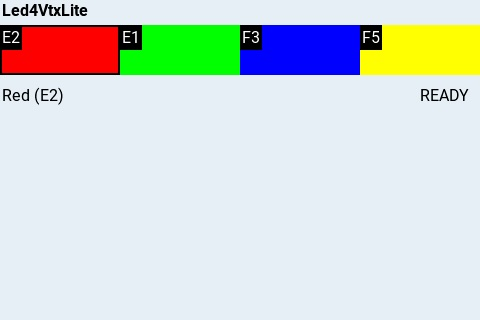

# Led4Vtx & Led4VtxLite

日本語版は下部にあります。

---

## English

### Prerequisites

Please configure your drone's LED Strip settings to display arbitrary colors in advance.
See (https://github.com/nkozawa/Led4Vtx/blob/main/img/LEDStrip.png) for a sample screen.

### Led4Vtx.lua


#### Installation

Copy `Led4Vtx.lua` to `/SCRIPTS/TOOLS/` on your transmitter.
To update to a new version, delete the old `Led4Vtx.luac` first.

#### Requirements

This script uses VTX functionality, so you must pre-register your favorite channels using [EasyVTXch.lua](https://github.com/Saqoosha/EasyVTXch).
Led4Vtx reads the `easyvtxch.fav` file created by EasyVTXch on startup.

- Register colors to favorites via screen tap or long-press on buttons.
- Tapping a favorite color with a VTX channel sets both the LED color and VTX channel on the drone.
- Tapping a color below favorites sends only the LED color to the drone.

### Led4VtxLite.lua


#### Installation

Copy `Led4VtxLite.lua` and `led4vtxlite.fav` to `/SCRIPTS/TOOLS/` on your transmitter.

This version runs without configuration. If you prepare `led4vtxlite.fav` according to race regulations, it works out of the box.

- On startup, if `led4vtxfav.txt` exists, color buttons are displayed. Tapping them sets both LED color and VTX channel on the drone simultaneously.
- Distributed `led4vtxlite.fav` content format:

```
E2,0,0,255
E1,120,0,255
F3,240,0,255
F5,60,0,255
```

- The first item is the VTX channel, followed by H, S, V values representing the color.
- By changing only H (Hue), you can change the LED color.
- In this example, from top to bottom: Red, Green, Blue, Yellow.

---

## 日本語

### 前提条件

ドローンのLED Strip設定画面で任意の色を表示するように設定しておくこと。
(https://github.com/nkozawa/Led4Vtx/blob/main/img/LEDStrip.png)にサンプル画面。

### Led4Vtx.lua


#### インストール

送信機の`/SCRIPTS/TOOLS/`にLed4Vtx.luaをコピーする。
新しいバージョンを導入する場合は、古いLed4Vtx.luacを削除してから行う。

#### 要件

VTXの機能を使用するため、予め[EasyVTXch.lua](https://github.com/Saqoosha/EasyVTXch)でお気に入りにチャネルを登録しておく必要があります。
Led4Vtxは起動時にEasyVTXchが作成する`easyvtxch.fav`ファイルを読み込みます。

- 画面またはボタンを長押ししてお気に入りに色を登録します。
- お気に入りの色をタップすると、VTXチャネルがあればLEDの色とVTXチャネルを同時にドローンに設定します。
- お気に入りの下の色をタップすると、LEDの色だけが機体に送られます。

### Led4VtxLite.lua



#### インストール

Led4VtxLite.luaとled4vtxlite.favファイルを`/SCRIPTS/TOOLS/`にコピーします。

設定なしで動作するバージョンです。レースレギュレーションに合わせて`led4vtxlite.fav`ファイルを用意しておけば、設定なしで動作します。

- 起動すると`led4vtxfav.txt`が存在すれば色のボタンが表示され、タップするとLEDの色とVTXチャネルが同時にドローンに設定されます。
- 配布される`led4vtxlite.fav`の内容形式:

```
E2,0,0,255
E1,120,0,255
F3,240,0,255
F5,60,0,255
```

- 最初の項目はVTXチャネル、続く3つの数字は色相(H)、彩度(S)、明度(V)を表す。
- Hだけを変化させればLEDの色を変更できる。
- この例では、上から赤、緑、青、黄となっている。
